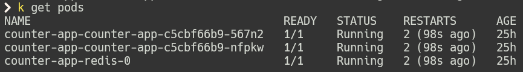
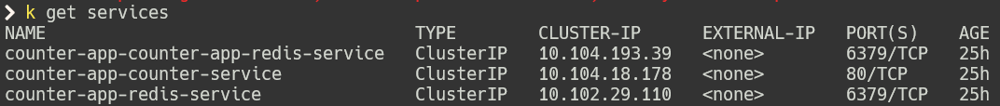
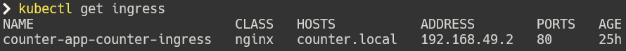
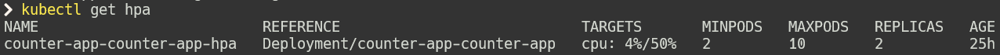
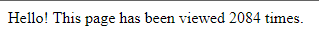
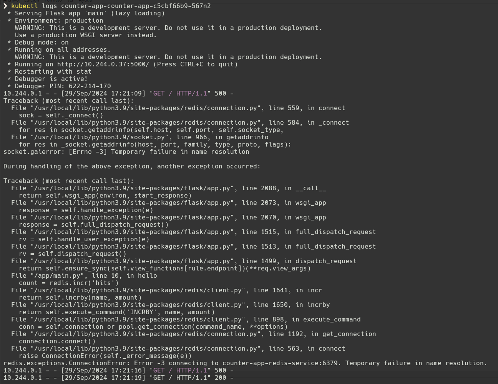

# Aplicación de Contador con Redis y Kubernetes

## Introducción
Este proyecto implementa una aplicación de contador utilizando Flask y Redis, desplegada en un clúster de Kubernetes mediante Helm. La aplicación muestra conceptos clave de desarrollo de microservicios, containerización y orquestación en la nube.

## Contenido
- [Enunciado de la Práctica](Documentacion/ENUNCIADO.md)
- [Guía de Instalación](Documentacion/INSTALACION.md)
- [Guía de Configuración](Documentacion/CONFIGURACION.md)
- [Guía de Escalado](Documentacion/ESCALADO.md)

## Visión General
La aplicación consiste en un servicio web simple que mantiene un contador en Redis. Está diseñada para ser escalable y resistente, aprovechando las capacidades de Kubernetes para la gestión de contenedores y el balanceo de carga.

### Características Principales
- Aplicación web Flask para incrementar y mostrar un contador
- Almacenamiento de datos persistente con Redis
- Despliegue en Kubernetes utilizando Helm
- Configuración de Ingress para el acceso externo
- Escalado horizontal automático basado en la carga de CPU

## Tecnologías Utilizadas
- Python con Flask para el backend
- Redis para el almacenamiento de datos
- Docker para la containerización
- Kubernetes para la orquestación de contenedores
- Helm para la gestión de paquetes de Kubernetes
- Minikube para el desarrollo local

## Instalación Rápida
Para una guía detallada de instalación, consulta [INSTALACION.md](Documentacion/INSTALACION.md).

1. Clona el repositorio
```bash
git clone https://github.com/ThomasAlbertoLombardo/Kubernetes_Final.git
cd Kubernetes_Final
```
2. Construye la imagen Docker
```bash
docker build -t thomasalberto/counter-app:v2 .
```
3. Carga la imagen en Minikube
```bash
minikube image load thomasalberto/counter-app:v2
```
4. Despliega la aplicación con Helm:
```bash
helm install counter-app ./helm-chart/counter-app
```
5. Verifica que los pods estén en ejecución:
```bash
kubectl get pods
```
6. Configura el acceso local:
```bash
echo "$(minikube ip) counter.local" | sudo tee -a /etc/hosts
```
7. Accede a la aplicación en tu navegador:
```bash
http://counter.local
```
## Resultado de la Práctica

### Pods en Ejecución


### Servicios Activos


### Ingress Configurado


### Escalado Automático


### Interfaz de Usuario


### Logs de Aplicación

7. Accede a la aplicación en tu navegador:
```bash
http://counter.local
```
